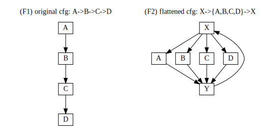

[<~ previous](https://github.com/smeets/cff) -- [next ~>](obfuscation)

# control flow flattening

## prelude

*Why do we obfuscate code? Is it good? Is it bad? Is it reasonable to obfuscate when SGX and ARM TrustZone exists, if so why? What is control flow flattening? Where does it fit in? How is it implemented? What are known weaknesses/attacks? Possible improvements?*

These are some of the underlying questions and thoughts this article aims to answer and discuss. As with many other things, there isn't a 100%-always-guaranteed-perfectly-correct-forever-and-ever answer. Obfuscation as a solution, however, is often frowned upon and it is hard to argue that it is implemented for the benefit of the consumer/end user. Instead, obfuscation is one of the tools business can use to protect their intellectual property (IP), and, depending on the implementation, may even result in a worse experience for the consumer/end user. While the specific reasonings why obfuscation is used are unknown to me, the general principle is clear: *to protect the product in a hostile environment*.

 > So what is this hostile environment, you ask? It is your phone, your computer, the wireless network in your home, the wonderful thing we call the internet, the servers that power your services. Generally, it is all the environments which the company does not fully control. One example are games running on your phone, console or computer. Big game publishers are using varying forms of digital rights management (DRM) software to protect their game (IP) against crackers and piracy.

To make some discussions easier and more informative these environments will be separated into *phone*, *pc* and *servers*. A short overview of protective measures and known attacks will be presented for each one of these environments.

## 1 - introduction

Control flow flattening is an obfuscation technique which aims to prevent identification of the control flow by means of static analysis. The obfuscation is based on two components: a *looped switch structure* and a *flattening transformation*. Basically, the flattening transformation rewrites the original control flow by introducing a looped switch to branch between (previously) connected basic blocks:

```
program_in -->       CFF magic       --> program_out

A->B->C->D --> switch + loop rewrite --> X->{A,B,C,D}->X
```

Compare the two following graphs



the cfg of (1) is given by the definition itself, while the cfg of (2) cannot be identified without inspecting the switch machine itself, i.e. how `X` selects the next block. This is the core obfuscation property (obfuscation relies on switch variable) and must therefore be as protected as it can.

But before we head on we should start with a few definitions and observations:

> (O1) Source code is compiled into logical **basic blocks**: units of code defined by the original programming language constructions (if, while, { }, for, etc..)

> (O2) The **control flow graph** describes all the possible execution paths of a procedure or program: one can view the graph nodes as *basic blocks* and graph edges as branches between the blocks (jumps, calls).

> (O3) **Static analysis** of a program binary tries to identify *basic blocks* and the edges between them and so uncover the *control flow graph*. This is not a trivial since the *basic block* is only a compiler/assembler concept and not present in the assembled binary. It is simpler to identify *basic blocks* by their branches than by their content, i.e. mark entry & exit points in the memory and use them to group instructions into blocks.

> (O4) **Control flow flattening** transforms a function *f* into *F*, with respect to some constraints:

> - same input, same output: *f(x) = F(x)*
> - stable ordering: *F* contains basic blocks of *f* in original order and executes them in the original order


From (O3) we see that branches convey useful of information about the control flow. So if we can hide the target address of a branch instruction then the analyser can only create an exit point (and not a corresponding entry point somewhere else).

 of the control flow graph is done by identifying edges (branches) between these *basic blocks*.

The flattening transform must
 - The *source code* is compiled into *machine instructions* by the compiler
 - Machine *instructions* can be grouped into *blocks* by jumps & entry points
 - These *blocks* are chained together to form *procedures*
 - A *program* consists of one or more *procedures*
 - The control flow graph is a graph which describes all possible execution paths of a particular *program*, *procedure* or *block*
 - Static analysis of the control flow graph is constructed by finding branches (implicit & explicit) between *blocks*
 - The *flattening transform* essentially combines a longer chain of branches (a->b->c->d) into a looping state machine (a->{b,c,d}), keeping the original order but preventing static analysis from discovering it by computing the next block during program execution
 - It is *allowed* to do anything imaginable as long as the input/output equivalence holds, e.g. the state machine can be arbitrarily complex


Layout of this document.

 - section 2: [an intro to obfuscation](obfuscation)
 - section 3: [algorithm](algorithm)
 - section 4: [analysis](analysis)
 - section 6: [attacking cff](attacking)
 - section 7: [improving cff](improving)
 - section 8: [available tools](tooling)

## 10 - summary

In the end, (software) obfuscation is used simply because there isn't a better alternative available, yet.


## 11 - links

 - [Obfuscating C++ programs via control flow flattening, T László and A Kiss, 2009](http://ac.inf.elte.hu/Vol_030_2009/003.pdf)
