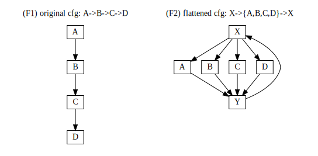

[cff](../cff) -- [analysis](../analysis) -- [attacking](../attacking) -- [attacking](../improving) -- [attacking](../tooling)

# control flow flattening

Control flow flattening is an obfuscation technique which aims to prevent identification of the control flow by means of static analysis. The obfuscation is based on two components: a *looped switch structure* and a *flattening transformation*. Basically, the flattening transformation rewrites the original control flow by introducing a looped switch to branch between (previously) connected basic blocks:

```
program_in -->       CFF magic       --> program_out

A->B->C->D --> switch + loop rewrite --> X->{A,B,C,D}->X
```

Compare the two following graphs



the cfg of (1) is given by the definition itself, while the cfg of (2) cannot be identified without inspecting the switch machine itself, i.e. how `X` selects the next block. This is the core obfuscation property (obfuscation relies on switch variable) and must therefore be as protected as best as possible.

But before we head on we should start with a few definitions and observations:

> (D1) Source code is compiled into logical **basic blocks**: units of code defined by the original programming language constructions (if, while, { }, for, etc..)

> (D2) The **control flow graph** describes all the possible execution paths of a procedure or program: one can view the graph nodes as *basic blocks* and graph edges as branches between the blocks (jumps, calls).

> (D3) **Control flow flattening** transforms a function *f* into *F*, with respect to some constraints:
>
>  - same input, same output: *f(x) = F(x)*
>  - stable ordering: *F* contains basic blocks of *f* in original order and executes them in the original order

> (D4) **Static analysis** of a program binary tries to identify *basic blocks* and the edges between them and so uncover the *control flow graph*.

(O1) The analysis in (D4) is not a trivial since the *basic block* is only a compiler/assembler concept and not present in the assembled binary. It is simpler to identify *basic blocks* by their branches than by their content, i.e. mark entry & exit points in the memory and use them to group instructions into blocks.


(O2) Based on (O1) branches convey useful of information about the control flow. So if it is possible to hide the target address of a branch instruction then the analyser can only create an exit point (and not a corresponding entry point somewhere else).

(O3) Since (D3) doesn't prohibit additional CFG nodes it is possible to introduce new blocks into the control flow graph that aren't present in the original. This is essentially what happends when the loop and switch machine is constructed: `loop_start` → `switch(X)` → `{A,B,C,D}` → `loop_end` → `loop_start`.

## previous work

Here are some interesting links:

 - wobba dubba made a great contribution and has been awarded +10 pts
 - long-kalsong-gong-gong wrote a good blog post about reversing +33 ptas

## algorithm / implementation

A flattening transform implementation could, in the spirit of go, look something like this:
```go
/* a simple flattening algorithm */
func Flatten(f: ir.Function)
    blocks       := f.BasicBlocks()
    switch_var   := ir.Var(types.Int32)
    switch_instr := ir.Switch(switch_var)
    loop_instr   := ir.While(ir.Bool.True)

    loop_instr.Add(switch_instr)

    /* map each top level block to its own case label */
    for i, block := range(blocks) {
        /* later on we want to sprinkle some magic on this computation */
        next_block_id   := i + 1
        next_block_expr := switch_var.Store(next_block_id)

        /* skip block=next and break if block terminates function */
        if !block.AllCodePathsReturn() {
          block.Add(next_block_expr)
          block.Add(switch_instr.Break())
        }
        switch_instr.Case(i, block)
    }

    f.BasicBlocks().Empty()
    f.Add(switch_var.Decl(0))
    f.Add(loop_instr)
}
```

### example (trivial)
Here is a very simple example (with some sketchy x86 assembly).
```go
/* original function, { ... } to force flattening  */
func Magic(x: int) int
{
                          // mov eax, x
    { x = x + 1; }        // add eax, 1
    { x = x % 3; }        // mod eax, 3
    { x = x * 2; }        // mul eax, 2
    { return x;  }        // ret
}

/* transforms into this monstrosity */
func Magic(x: int) int
{
    block := 0;           // mov block, 0
    while (true) {        // label loop_0_start
        switch (block) {  // label loop_0_switch_0_start
                          //     # jump to case impl.
        case 0:           // label loop_0_switch_0_case_0
            x = x + 1;    //     mov eax, x
                          //     add eax, 1
            block = 1;    //     mov block, 1
            break;        //     jmp loop_0_switch_0_end
        case 1:           // label loop_0_switch_0_case_1
            x = x % 3;    //     mod eax, 3
            block = 2;    //     mov block, 3
            break;        //     jmp loop_0_switch_0_end
        case 2:           // label loop_0_switch_0_case_2
            x = x * 2;    //     mul eax, 2
            block = 3;    //     mov block, 3
            break;        //     jmp loop_0_switch_0_end
        case 3:           // label loop_0_switch_0_case_3
            return x;     //     ret
        }
                          // label loop_0_switch_0_end
                          //     jmp loop_0_start
    }
}
```
The assembly of the flattened function is indeed more complicated and does more work compared to the original. The function output, however, is equivalent to the original.

### example (AES)
Control flow flattened version of AES.